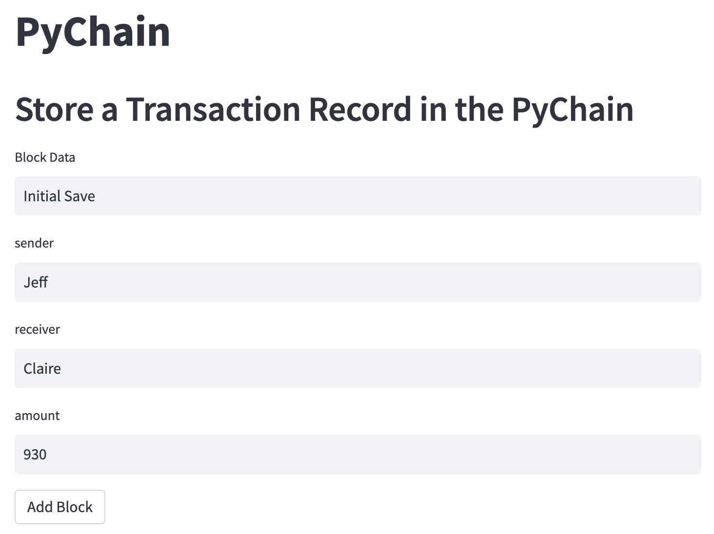
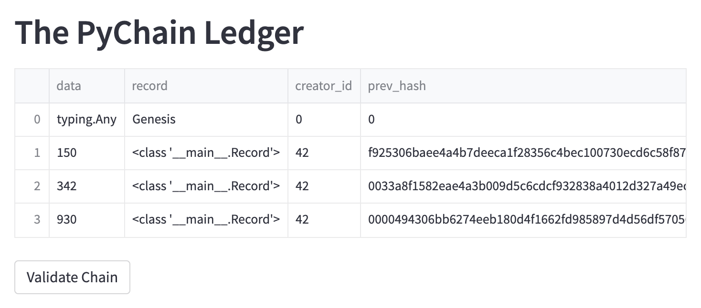
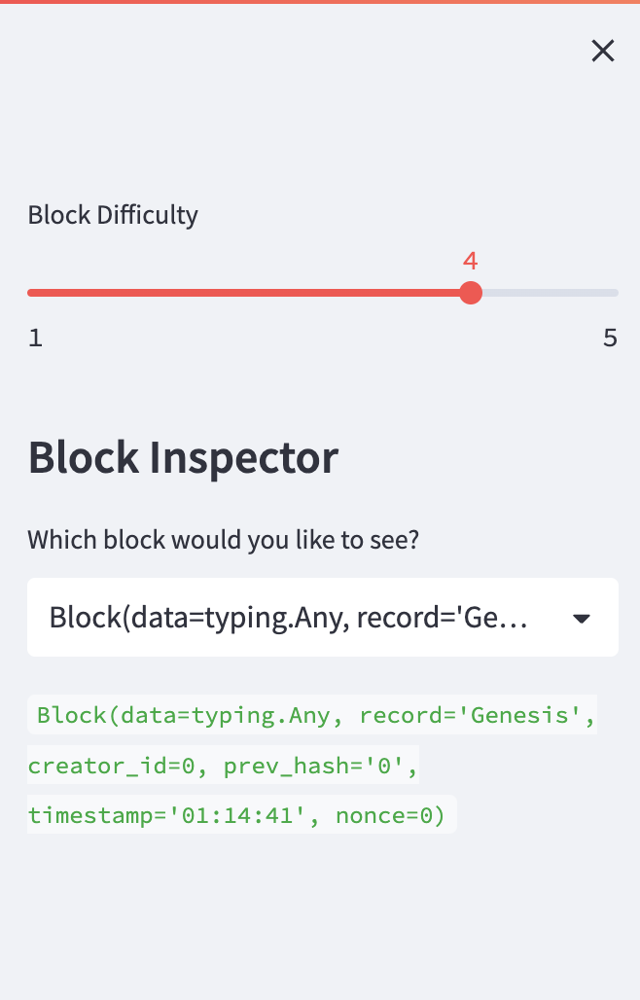
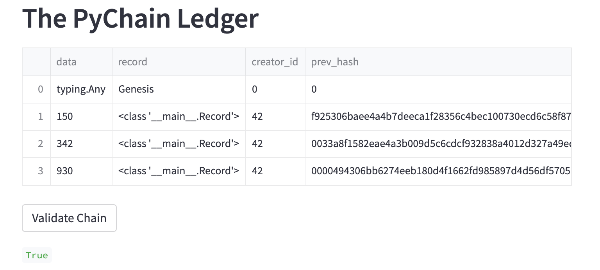

# PyChain Ledger

Our bank requires a user-friendly web interface ledger that transfers funds and verify the transfers with integrity. We will create a record on a blockchain that stores data for each transaction and secure each transaction with a unique hash as the blockchain builds. 

## Instructions

To test the `PyChain` ledger and user interface run your Streamlit application and storing some mined blocks in your `PyChain` ledger. Then test the blockchain validation process by using your `PyChain` ledger. To do so, complete the following steps:

1. In the terminal, navigate to the project folder.

2. In the terminal, run the Streamlit application by using `streamlit run pychain.py` and the below website will populate. 

3. Enter values for the sender, receiver, and amount, and then click the Add Block button as seen above. Do this several times to store several blocks in the ledger as you can see below. 

4. Verify the block contents and hashes in the Streamlit dropdown menu seen below. 

5. Test the blockchain validation process by using the web interface, you will receive a true reading once validated. 

